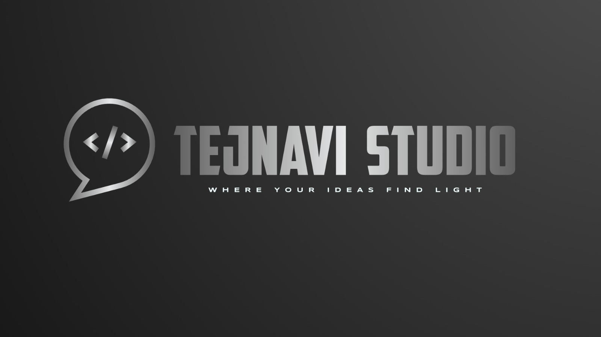

# 
TEJNAVI STUDIO

  

 

## 🛡️ Digital Architecture & Automation
**TEJNAVI STUDIO** is a specialized digital startup focused on the intersection of AI-powered automation and high-performance software. We build scalable foundations for businesses to transition from manual workflows to intelligent, automated systems.

---

## 🔍 Focus Areas

# **The Problem**
> ### Modern businesses are often throttled by fragmented workflows, inefficient legacy systems, and a lack of data-driven decision-making tools.

 

# **Our Approach**
> ### We engineer custom-built applications, AI-powered tools, and high-performance websites designed to consolidate operations and scale seamlessly with client demand.

 

---

## 🛠️ Technical Ecosystem
Our engineering team utilizes a robust, modern stack for scalable development.

### **Languages & Frameworks**

 &nbsp;  &nbsp;  &nbsp; 

### **Databases & Infrastructure**
 &nbsp;  &nbsp;  &nbsp; 

---

## 👥 Team & Operations
Managing a multi-disciplinary team focused on strategy and high-level execution.

* **Engineering:** Backend, Frontend, and Full Stack Specialists.
* **Operations:** Strategy, Management, and Social Media Management.
* **Current Status:** Building MVPs | Active Team Expansion.

---

## 📩 Contact & Inquiry
For professional outreach or contributor applications:

## **[tejnavi.studio@gmail.com](mailto:tejnavi.studio@gmail.com)**

 

  <i>Where your ideas find light.</i>

